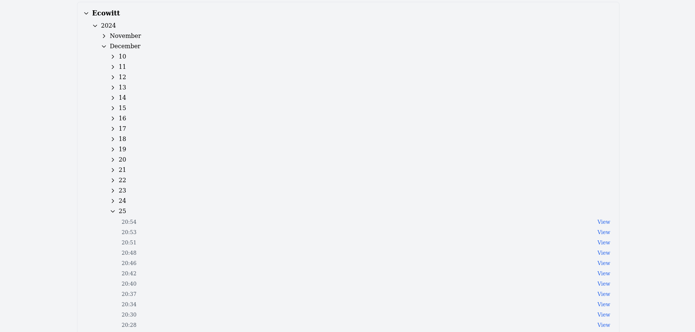

# ETA to Ecowitt Weather Station Connector


A Next.js 15 application for connecting ETA and Ecowitt Weather Station to provide real-time temperature information for both indoor and outdoor temperatures, ETA system data, and control the ETA heating system.

Connects the temperature sensors of an Ecowitt weather station with an ETA heating system and takes over the temperature control of the heating system. Thus replaces an ETA room thermostat.

This project was developed using Windsurf, an advanced AI-powered development environment. The entire codebase was programmed through pair programming with Claude 3.5 Sonnet, making it a showcase of modern AI-assisted development.

> Major UI/UX redesign completed September 2025 - Enhanced with unified tab interface, improved mobile experience, and intelligent background synchronization

> Optimized with GPT‑5, Claude 4, August 2025

Visit Windsurf at https://windsurf.com

## Features

- **Modern Responsive UI Design**
  - **Unified Tab Layout**: Single-page application with seamless tab navigation
  - **Hero Dashboard**: Centralized overview showing key metrics at a glance
    - Current indoor/outdoor temperatures with live updates
    - Temperature difference calculations with color coding (green/blue)
    - ETA system status and slider position
    - Weather station connectivity status
  - **Mobile-First Design**: Optimized for touch devices with responsive breakpoints
  - **Custom Component System**: Consistent design language with badges, buttons, and cards
  - **Real-time Updates**: Live data synchronization without page refreshes

- **Advanced Temperature Control System**
  - **Intelligent Background Service**: Server-side temperature management
    - Automatic slider position calculation based on indoor/outdoor differential
    - Real-time ETA device communication and status monitoring
    - Persistent configuration with file-based storage
    - Robust error handling and retry mechanisms
  - **Smart Configuration Interface**:
    - **Enhanced Number Inputs**: Large, clickable spinner buttons for easy mobile use
    - **Live Value Updates**: Configuration changes reflect immediately in UI
    - **Validation & Limits**: Input constraints with visual feedback
    - **Auto-sync**: Backend recalculates values instantly after config changes
    - **Delta Override Toggle**: Switch between automatic and manual delta control
      - Auto: delta is calculated from ETA vs WiFi outdoor temperature difference
      - Manual: uses the user-entered `t_delta` value exclusively
  - **Temperature Control Features**:
    - **Target Temperature (`t_soll`)**: Main setpoint with 0.5°C precision
    - **Delta Temperature (`t_delta`)**: Fine-tuning offset for comfort zones
    - **Minimum Protection (`t_min`)**: Prevents room temperature drops below threshold
    - **Slider Position (`t_slider`)**: Automated ETA valve control (0-100%)
    - **Override Duration (`t_override`)**: Manual control timeout in minutes
    - **Update Intervals**: Configurable polling rates with minimum API protection
    - **Automatic Delta Management**: When override is disabled, `t_delta` is updated automatically from the signed ETA/WiFi outdoor difference with throttling and significance thresholds

- **Interactive Heating Schedule Management**
  - **Visual Timeline Interface**: 0–24h timeline with clear hour markers
  - **Drag & Drop Time Windows**: Intuitive segment editing with 15-minute snapping
  - **Multi-Day Synchronization**: 
    - Individual sync checkboxes per day and time window
    - Selective day synchronization (e.g., exclude weekends)
    - Automatic time propagation across synced days
    - Smart bulk save for synchronized time windows
  - **Touch-Optimized Controls**: 
    - Visible handles for precise segment adjustment
    - Collision prevention with visual feedback
    - Tooltip bubbles showing exact time ranges
    - Mobile gesture support with scroll prevention
  - **Real-time API Integration**: Direct ETA system updates via `API.ETA_UPDATE`

- **Comprehensive System Monitoring**
  - **ETA Heating System Interface**:
    - Live system data display (temperatures, pressures, status indicators)
    - Interactive control buttons with state management
    - Manual override system with countdown timers
    - Automatic mode switching based on temperature thresholds
  - **Weather Station Integration**:
    - Real-time indoor/outdoor temperature monitoring
    - Humidity and pressure readings
    - Multi-channel sensor support with custom naming
    - Historical data visualization
  - **Background Data Synchronization**:
    - Automatic polling with configurable intervals
    - Smart refresh on browser focus/visibility changes
    - Conflict-free updates with abort controller pattern
    - Persistent state management across sessions

- **Enhanced User Experience**
  - **Stable UI Rendering**: No flickering during data updates or browser minimize/maximize
  - **Improved Input Controls**: Custom spinner buttons replace tiny browser arrows
  - **Color-Coded Status Indicators**: Intuitive green/blue/red system for quick status recognition
  - **Toast Notifications**: Success/error feedback for user actions
  - **Responsive Navigation**: Collapsible menu system for mobile devices
  - **Loading States**: Skeleton screens and progress indicators

- **Interactive Charts**
  - Real-time visualization of temperature and humidity data
  - Responsive Chart.js integration with zoom functionality
  - Custom styling with Geist Mono font
  - Multiple chart views:
    - Main chart (temperature, pressure, humidity)
    - Channel temperature chart
    - Channel humidity chart
  - Interactive features:
    - Zoom reset functionality
    - Custom tooltips with formatted timestamps
    - Zero line indicators for temperature charts
  
- **Performance Optimization**
  - Client-side only chart rendering to prevent SSR issues
  - Memory leak prevention through:
    - Proper cleanup of chart instances
    - Dynamic imports for heavy components
    - Efficient data structure management
  - TypeScript for enhanced type safety
  
- **Logging System**
  - Organized log files by type and date
  - Interactive log viewer interface
  - Filterable log categories
  - Accessible via dedicated `/logs` route
  
- **API Integration**
  - ETA heating system API integration
  - Weather station (WifiAf83) data retrieval
  - Real-time data updates

## Pages and Features

### Main Dashboard (/)
The redesigned main dashboard features a modern, unified tab interface:

**Hero Section**
- **Live Temperature Display**: Real-time indoor/outdoor temperatures with automatic updates
- **Smart Status Indicators**: Color-coded badges showing system health at a glance
- **Temperature Differential**: ETA vs WiFi outdoor temperature comparison with visual indicators
- **Slider Position**: Current ETA valve position with recommended settings

**Integrated Tab Navigation**
- **Configuration**: Enhanced temperature control with improved number inputs
  - Large, clickable spinner buttons for mobile-friendly operation
  - Live value synchronization between frontend and backend
  - Instant feedback for configuration changes
  - Delta Override toggle (Auto/Manuell) controlling automatic delta calculation
- **ETA Data**: Complete system monitoring with stable rendering
  - All ETA parameters displayed without flickering during updates
  - Interactive control buttons with manual override capabilities
  - Real-time status updates with persistent display during browser state changes
- **Zeitfenster (Time Windows)**: Advanced scheduling interface
  - Visual 24-hour timeline with drag-and-drop time segments
  - Multi-day synchronization with selective day control
  - Bulk editing capabilities for efficient schedule management
- **WiFi Data**: Weather station monitoring with enhanced reliability
  - Stable data display during browser minimize/maximize operations
  - Multi-channel temperature and humidity readings
  - Historical data access and visualization
  - Live Diff Indoor/Soll calculation: `(t_soll + t_delta/DELTA_DAMPENING_FACTOR) - indoorTemperature`

### Weather Graphs (/weather)
Detailed weather visualization and analysis:
- Interactive temperature and humidity graphs
- Multiple time range options (24h, 7d, 30d)
- Pressure trends and analysis
- Channel-specific data views
- Zoom and pan capabilities
- Custom tooltips with detailed information
- Auto-scaling axes
- Mobile-responsive layout

### Raw ETA Data (/raw-eta)
Direct access to the ETA heating system's raw data:
- Complete hierarchical view of all system parameters
- Search functionality for both URIs and parameter names
- Expandable/collapsible sections for better organization
- Real-time data updates with 1-minute cache
- XML data parsing with structured display
- Quick access to both raw and parsed values
- Mobile-optimized interface with menu below data on smaller screens

### System Logs (/logs)
Comprehensive logging system for monitoring and debugging:
- Categorized log entries (System, ETA, Weather)
- Time-stamped entries with severity levels
- Filterable log views
- Real-time log updates
- Log file navigation and selection
- Downloadable log files
- Color-coded severity levels
- Search functionality within logs

## Technical Details

- **Framework**: Next.js 15.0.3
- **UI Components**: React 18.2.0
- **State Management**: Redux with @reduxjs/toolkit 2.3.0
- **Styling**: Tailwind CSS
- **Server**: Custom Node.js server with background services
- **Development**: 
  - TypeScript for type safety
  - ESLint for code quality
  - Cross-env for environment management

### Temperature Calculation Method

The system uses a sophisticated temperature differential calculation to determine heating requirements:

**Diff Indoor/Soll Calculation:**
```
diff = (t_soll + t_delta / DELTA_DAMPENING_FACTOR) - indoorTemperature
```

**Parameters:**
- `t_soll`: Target room temperature set by user (°C)
- `t_delta`: Temperature offset adjustment (°C)
  - Automatically calculated from ETA vs WiFi outdoor temperature difference (when Delta Override is disabled)
  - Can be manually set (when Delta Override is enabled)
  - **Divided by DELTA_DAMPENING_FACTOR** to apply a dampened correction factor
- `DELTA_DAMPENING_FACTOR`: Global constant controlling temperature correction aggressiveness
  - **Default: 5.0** (dampens delta by 80%)
  - **Location**: `src/reader/functions/types-constants/ConfigConstants.ts`
  - Higher values = less aggressive correction, Lower values = more aggressive correction
  - **Change this single value to adjust the dampening factor globally**
- `indoorTemperature`: Current room temperature from WiFi sensor (°C)

**Result Interpretation:**
- **Positive value** (e.g., +1.5°C): Room is colder than target → More heating needed (displayed in green)
- **Negative value** (e.g., -0.8°C): Room is warmer than target → Less heating needed (displayed in blue)
- **Zero**: Room is at target temperature (displayed in neutral)

**Precision:**
- Calculation result is rounded to **2 decimal places** (0.01°C precision)
- Displayed with 2 decimal places in all UI components

**Safety Limits:**
- `MAX_DELTA_VALUE`: Maximum allowed delta for automatic updates
  - **Default: 5.0°C** (allows delta values between -5°C and +5°C)
  - **Location**: `src/reader/functions/types-constants/ConfigConstants.ts`
  - Prevents extreme outdoor temperature differences from causing unsafe heating adjustments
  - If `|outdoorDiff| > MAX_DELTA_VALUE`, automatic delta update is blocked and logged

**Implementation Locations:**
- **Global constants**: `src/reader/functions/types-constants/ConfigConstants.ts` (TEMP_CALC_CONSTANTS)
- Frontend display: `src/components/HomeHero.tsx` (line 55)
- WiFi data tab: `src/components/WifiAf83Data.tsx` (line 260)
- Backend calculation: `src/utils/Functions.ts` (line 62)
- Safety check: `src/components/HomeHero.tsx` (line 144)
- Used by background service for automatic slider position control

This calculation directly influences the **slider position** (0-100%) which controls the ETA heating valve position.

### Slider Position Calculation

The system calculates the ETA heating valve position (slider position) in two stages: **base calculation** from temperature differential and **scaling** based on flow temperature.

#### Stage 1: Base Position Calculation

The base slider position is calculated from the temperature differential using a linear mapping:

```
basePosition = map(diff, 1.25, 5.0, 0.0, 100.0)
```

**Mapping Function:**
- **Input Range**: `diff` from 1.25°C to 5.0°C
- **Output Range**: 0% to 100%
- **Linear Interpolation**: 
  - `diff ≤ 1.25°C` → 0% (no heating needed)
  - `diff ≥ 5.0°C` → 100% (maximum heating)
  - `1.25°C < diff < 5.0°C` → proportional value

**Example:**
- `diff = 1.25°C` → `basePosition = 0%`
- `diff = 3.125°C` → `basePosition = 50%` (midpoint)
- `diff = 5.0°C` → `basePosition = 100%`

**Special Cases:**
- **Heating Disabled**: If `einaus = "Aus"` OR (`schaltzustand = "Aus"` AND no manual override active), slider position is forced to `0%`
- **Negative Differential**: If `diff < 0` (room warmer than target), base position can be negative (e.g., `-5%`). These values are **not scaled** in Stage 2.

#### Stage 2: Flow Temperature Scaling

The base position is scaled based on the **Vorlauftemperatur** (flow temperature) to prevent overheating:

```
vorlaufFactor = {
  1.0           if vorlauftemp ≤ 38°C  (no reduction)
  0.0           if vorlauftemp ≥ 50°C  (heating off)
  (50 - vorlauftemp) / 12   if 38°C < vorlauftemp < 50°C  (linear reduction)
}

finalPosition = basePosition × vorlaufFactor
```

**Flow Temperature Thresholds:**
- **≤ 38°C**: Full base position (100% adoption, factor = 1.0)
- **38-50°C**: Linear reduction based on flow temperature
- **≥ 50°C**: Slider position forced to 0% (factor = 0.0)

**Example Calculation:**
```
Given Values:
- Indoor: 21.6°C
- Target (t_soll): 22°C
- Delta (t_delta): 2.9°C  ← This is NOT the temperature difference!
- Flow Temp: 48°C

Important: t_delta is a CORRECTION FACTOR, not the actual temperature difference.
It's calculated from outdoor temperature differences (ETA vs WiFi) and used to 
fine-tune the heating behavior.

Step 1: Calculate diff (the actual heating requirement)
diff = (t_soll + t_delta / DELTA_DAMPENING_FACTOR) - indoorTemperature
diff = (22 + 2.9/5.0) - 21.6
diff = (22 + 0.58) - 21.6
diff = 22.58 - 21.6
diff = 0.98°C

Explanation:
- Target - Indoor = 22 - 21.6 = 0.4°C (simple difference)
- But t_delta adds a correction: +2.9°C / 5.0 = +0.58°C
- This increases the effective target to 22.58°C
- Final diff = 22.58 - 21.6 = 0.98°C

Step 2: Calculate base position
basePosition = map(0.98, 1.25, 5.0, 0.0, 100.0)
Since 0.98 < 1.25 (minimum threshold), basePosition would be 0% or negative.

Let's use a more realistic example where heating is actually needed:
diff = 3.2°C → basePosition = map(3.2, 1.25, 5.0, 0, 100) = 52%

Step 3: Calculate flow temperature factor
vorlauftemp = 48°C
vorlaufFactor = (50 - 48) / 12 = 0.167

Step 4: Calculate final position
finalPosition = 52% × 0.167 = 8.7% → rounded to 9%

Display: "Schieberposition: 52 % → 9 %"
```

**Why is t_delta 2.9°C when target - indoor = 0.4°C?**

`t_delta` is **NOT** the temperature difference between target and indoor. Instead:

1. **t_delta** is calculated from **outdoor temperature sensors**:
   - `t_delta = ETA_outdoor - WiFi_outdoor` (in automatic mode)
   - Example: ETA reads -5°C, WiFi reads -10°C → t_delta = 5°C
   - This compensates for sensor placement differences or calibration offsets

2. **t_delta is dampened** before use:
   - Applied as: `t_delta / DELTA_DAMPENING_FACTOR` (default: 5.0)
   - Example: `2.9°C / 5.0 = 0.58°C` actual correction
   - This prevents aggressive over-corrections

3. **Purpose of t_delta**:
   - Adjusts heating based on outdoor conditions
   - Compensates for sensor differences
   - Provides fine-tuning capability
   - Can be manually set for comfort preferences

**Protection for Negative Values:**
- Negative base positions (when room is warmer than target) are **NOT scaled** by flow temperature
- Example: `basePosition = -5%` → `finalPosition = -5%` (regardless of flow temperature)

#### Minimum Temperature Protection

When the indoor temperature falls below the configured minimum temperature (`t_min`), the system activates protection mode:

**Behavior:**
1. **Temperature Check**: `indoorTemp < t_min`
2. **Override Activation**: System automatically enables manual override mode
3. **Override Duration**: Controlled by `t_override` (default: 10 minutes = 600000ms)
4. **Heating Forced On**: Slider position is calculated normally, but heating buttons are activated
5. **Automatic Deactivation**: After override duration expires, system returns to normal mode

**Example:**
```
Configuration:
- t_min = 18.5°C
- t_override = 600000ms (10 minutes)

Scenario:
- Indoor temperature drops to 18.2°C
- System detects: 18.2 < 18.5
- Override activated for 10 minutes
- Heating forced on regardless of other conditions
- After 10 minutes: Override expires, normal operation resumes
```

**Purpose:**
- Prevents room temperature from dropping too low
- Provides emergency heating in cold conditions
- Automatically recovers without user intervention

#### Delta Temperature (`t_delta`)

The delta temperature is a fine-tuning offset that adjusts the target temperature calculation. It can operate in two modes:

**Mode 1: Automatic (Delta Override = OFF)**
- `t_delta` is **automatically calculated** from the difference between ETA outdoor temperature and WiFi outdoor temperature
- Formula: `t_delta = (ETA_outdoor - WiFi_outdoor)` with dampening
- **Dampening Factor**: Divided by `DELTA_DAMPENING_FACTOR` (default: 5.0) to prevent aggressive corrections
- **Safety Limit**: `MAX_DELTA_VALUE` (default: 5.0°C) prevents extreme values
- **Update Throttling**: Only updates when difference is significant (> 0.1°C change)

**Mode 2: Manual (Delta Override = ON)**
- `t_delta` is **manually set** by the user
- System uses this fixed value exclusively
- No automatic updates from outdoor temperature differences
- Useful for fine-tuning comfort zones or testing

**Effect on Calculation:**
```
diff = (t_soll + t_delta / DELTA_DAMPENING_FACTOR) - indoorTemperature
```

**Example:**
```
Automatic Mode (Override OFF):
- ETA outdoor: -3°C
- WiFi outdoor: -5°C
- Calculated delta: (-3) - (-5) = 2°C
- Applied delta: 2 / 5.0 = 0.4°C
- Effect: Slightly increases target temperature

Manual Mode (Override ON):
- User sets t_delta = 1.5°C
- Applied delta: 1.5 / 5.0 = 0.3°C
- Effect: Fixed offset regardless of outdoor conditions
```

**Override Duration (`t_override`):**
- Controls how long manual heating button presses remain active
- Default: 600000ms (10 minutes)
- After expiration: System returns to automatic mode
- Also used for minimum temperature protection duration

#### Implementation Locations

**Slider Calculation:**
- `src/utils/Functions.ts` - `calculateNewSliderPosition()` (lines 26-67)
- `src/reader/functions/SetEta.ts` - `calculateNewSliderPosition()` (lines 100-130)
- `src/lib/backgroundService.ts` - Automatic updates (lines 656-746)

**Flow Temperature Scaling:**
- Uses `EtaConstants.VORLAUFTEMP` (ID: `/120/10101/0/0/12241`)
- Scaling thresholds: 38°C (full), 50°C (off)

**Display:**
- `src/components/EtaTab.tsx` - Shows both base and final values (lines 31-70)
- Format: "Schieberposition: 52 % → 9 %" (base → final)

**Configuration Storage:**
- `ConfigKeys.T_SLIDER_BASE` - Calculated base position before scaling
- `ConfigKeys.T_SLIDER` - Final position after flow temperature scaling

## Project Structure

```
eta2weather.nextjs15/
├── src/
│   ├── app/                    # Next.js 15 App Router
│   │   ├── api/               # API Routes (Server-side endpoints)
│   │   │   ├── background/    # Background service status & control
│   │   │   │   └── status/    # Real-time system status endpoint
│   │   │   ├── config/        # Configuration management
│   │   │   │   ├── read/      # Read current config
│   │   │   │   └── route.ts   # Update config values
│   │   │   ├── eta/          # ETA heating system integration
│   │   │   │   ├── menu/      # ETA menu structure
│   │   │   │   ├── raw/       # Raw ETA XML data
│   │   │   │   ├── read/      # Processed ETA data
│   │   │   │   ├── readBatchMenuData/ # Batch menu data
│   │   │   │   ├── readMenuData/ # Single menu item
│   │   │   │   └── update/    # ETA parameter updates
│   │   │   ├── logs/         # System logging endpoints
│   │   │   ├── names2id/     # Name-to-ID mapping management
│   │   │   ├── weather/      # Historical weather data
│   │   │   └── wifiaf83/     # WiFi weather station
│   │   │       ├── all/      # All sensor data
│   │   │       └── read/     # Current readings
│   │   ├── fonts/           # Custom fonts (Geist, GeistMono)
│   │   ├── logs/            # System logs viewer page
│   │   ├── raw-eta/         # Raw ETA data explorer
│   │   ├── weather/         # Weather visualization graphs
│   │   ├── favicon.ico      # App icon
│   │   ├── globals.css      # Global styles & CSS variables
│   │   ├── layout.tsx       # Root layout with providers
│   │   └── page.tsx         # Main dashboard (unified tab interface)
│   ├── components/          # React UI Components
│   │   ├── BackgroundSync.tsx   # Real-time data synchronization
│   │   ├── ConfigData.tsx       # Enhanced configuration interface
│   │   ├── EtaData.tsx         # ETA system monitoring & control
│   │   ├── Header.tsx          # Navigation header with menu
│   │   ├── HomeHero.tsx        # Dashboard hero section
│   │   ├── MenuPopup.tsx       # Mobile navigation menu
│   │   ├── Names2IdData.tsx    # Name mapping management
│   │   ├── ToastProvider.tsx   # Toast notification system
│   │   ├── WeatherCharts.tsx   # Interactive weather graphs
│   │   ├── WifiAf83Data.tsx    # Weather station interface
│   │   └── ZeitfensterTab.tsx  # Advanced time window scheduler
│   ├── config/             # JSON Configuration Files
│   │   ├── f_eta.json      # ETA system parameters
│   │   ├── f_etacfg.json   # Main application config
│   │   ├── f_etamenu.json  # ETA menu structure cache
│   │   ├── f_names2id.json # Parameter name mappings
│   │   └── f_wifiaf89.json # Weather station data cache
│   ├── constants/          # Application Constants
│   │   └── apiPaths.ts     # Centralized API endpoint definitions
│   ├── hooks/              # Custom React Hooks
│   │   └── useEtaData.ts   # ETA data management hook
│   ├── lib/                # Core Business Logic
│   │   └── backgroundService.ts # Intelligent background processing
│   ├── reader/             # Data Processing & External APIs
│   │   └── functions/      # Core functionality modules
│   │       ├── EtaApi.ts       # ETA heating system API client
│   │       ├── EtaData.ts      # ETA data processing
│   │       ├── SetEta.ts       # ETA parameter control
│   │       ├── WifiAf83Api.ts  # Weather station API client
│   │       ├── readMenuData.ts # ETA menu data parser
│   │       └── types-constants/ # TypeScript definitions
│   │           ├── ConfigConstants.ts  # Configuration types
│   │           ├── EtaConstants.ts     # ETA system types
│   │           ├── Names2IDconstants.ts # Name mapping types
│   │           ├── TimerConstants.ts   # Timing constants
│   │           └── WifiAf83.ts        # Weather station types
│   ├── redux/              # Global State Management
│   │   ├── configSlice.ts      # Configuration state
│   │   ├── etaSlice.ts        # ETA system state
│   │   ├── index.ts           # Store configuration
│   │   ├── names2IdSlice.ts   # Name mapping state
│   │   └── wifiAf83Slice.ts   # Weather data state
│   ├── styles/             # CSS Styling System
│   │   ├── components/     # Component-specific styles
│   │   │   ├── badge.css       # Status badges
│   │   │   ├── button.css      # Interactive buttons
│   │   │   ├── card.css        # Content cards
│   │   │   ├── input.css       # Enhanced form inputs
│   │   │   ├── progress.css    # Progress indicators
│   │   │   ├── segmented.css   # Segmented controls
│   │   │   ├── switch.css      # Toggle switches
│   │   │   ├── tabs.css        # Tab navigation
│   │   │   └── toast.css       # Notification toasts
│   │   └── globals.css     # Base styles & utilities
│   └── utils/              # Utility Functions
│       ├── cache.ts        # File-based caching system
│       └── logging.ts      # Structured logging utilities
├── public/                 # Static Assets
│   ├── log/               # Log file storage
│   ├── screen/            # Application screenshots
│   │   ├── l1.png, l2.png # Log interface screenshots
│   │   ├── m1.png, m2.png, m3.png # Main dashboard views
│   │   ├── r1.png         # Raw data interface
│   │   └── w1.png, w2.png # Weather graphs
│   ├── config-logo.jpg    # Configuration tab icon
│   ├── eta-logo.png       # ETA system logo
│   └── *.svg             # Various UI icons
├── docs/                  # Documentation
│   ├── background-service-analysis.md # Service architecture
│   └── ui-modernization.md           # UI redesign notes
├── linux/                 # Linux Deployment
│   └── docker-compose-app.service   # systemd service file
├── osx/                   # macOS Deployment
│   ├── com.etaweather.docker-compose.plist # Launch agent
│   ├── install.sh         # Installation script
│   └── uninstall.sh       # Removal script
├── windows/               # Windows Deployment
│   ├── install-service.ps1    # Service installation
│   └── uninstall-service.ps1 # Service removal
├── .env.example           # Environment configuration template
├── .env.local            # Local environment settings
├── docker-compose.yml    # Docker deployment configuration
├── Dockerfile           # Container build instructions
├── eco.example.ts       # Weather API configuration template
├── next.config.mjs      # Next.js configuration
├── package.json         # Dependencies & scripts
├── server.ts           # Custom Node.js server
├── tailwind.config.ts  # Tailwind CSS configuration
└── tsconfig.json       # TypeScript configuration
```

## Screenshots and Features

### Main Dashboard (M1-M3)

*Main dashboard showing current temperature, humidity, and system status*


*Temperature control interface with tabs and current settings*


*Detailed system status indicators and controls*

### Weather Graphs (W1-W2)

*Comprehensive weather data visualization showing temperature, humidity, and pressure trends*


*Individual channel temperature and humidity data with interactive zoom*

The weather graphs provide:
- Real-time temperature, humidity, and pressure visualization
- Interactive zooming and panning
- Multiple time range options
- Custom tooltips with detailed information
- Zero-line indicators for temperature reference
- Automatic scale adjustment
- Channel-specific data views
- Mobile-responsive design

### Raw Data Interface (R1)

*Structured view of raw ETA system data*

The raw data interface features:
- Hierarchical display of all ETA system parameters
- Search functionality for both URIs and parameter names
- Expandable/collapsible sections for better organization
- Real-time data updates with 1-minute cache
- Clear visualization of value types and units
- Mobile-friendly responsive design
- XML data parsing and structured display
- Quick access to both raw and parsed values

### Log Data (L1-L2)

*Log data overview with filtering options*


*Detailed log entries with timestamp and category information*

## Setup and Installation

1. Clone the repository
2. Create `.env` file from example:
   ```bash
   cp .env.example .env
   ```
   Update the server address in `.env`:
   ```bash
   DEFAULT_CONFIG_FILE='./config/f_etacfg.json'
   DEFAULT_SERVER='192.x.x.x:8080'  # Replace with your server address
   ```
3. Configure Ecowitt API (if using weather station):
   ```bash
   cp eco.example.tsx eco.ts
   ```
   Update with your Ecowitt credentials:
   ```typescript
   config: {
     applicationKey: "XXX", // From Ecowitt API Settings
     apiKey: "XXX",        // Generated API Key
     mac: "XXX",           // Device MAC Address
     server: "api.ecowitt.net"
   }
   ```
   See `eco.example.ts` for detailed instructions on obtaining API credentials.

4. Install dependencies:
   ```bash
   npm install
   ```
5. Run the development server:
   ```bash
   npm run dev
   ```

## API Documentation

### ETA System Endpoints

#### Read Operations
- `GET /api/eta/read`: Retrieves current ETA system data
- `GET /api/eta/raw`: Fetches raw ETA system data with XML values
- `GET /api/eta/menu`: Gets the ETA menu structure
- `GET /api/eta/readMenuData`: Retrieves specific menu item data
- `POST /api/eta/readBatchMenuData`: Batch retrieves menu data for multiple URIs
  ```typescript
  // Request body
  {
    "uris": string[]  // Array of URIs to fetch
  }
  ```

#### Update Operations
- `POST /api/eta/update`: Updates ETA system values
  ```typescript
  // Request body
  {
    "id": string,     // Parameter ID
    "value": string,  // New value
    "begin"?: string, // Optional start time (default: "0")
    "end"?: string    // Optional end time (default: "0")
  }
  ```

### Weather Data Endpoints

#### Read Operations
- `GET /api/weather`: Retrieves weather data with optional date range
  - Query params: `range` (e.g., "24h", "7d", "30d")
- `GET /api/wifiaf83/read`: Gets current WiFi sensor data
- `GET /api/wifiaf83/all`: Retrieves all available WiFi sensor data

### Configuration Endpoints

#### Read Operations
- `GET /api/config/read`: Retrieves current configuration
- `GET /api/names2id/read`: Gets name-to-ID mappings

#### Update Operations
- `POST /api/config/update`: Updates configuration values
  ```typescript
  // Request body
  {
    "key": string,   // Configuration key
    "value": string  // New value
  }
  ```
- `POST /api/channelnames`: Updates channel names
  ```typescript
  // Request body
  {
    [channelId: string]: string  // Map of channel IDs to names
  }
  ```

### System Status Endpoints

- `GET /api/background/status`: Retrieves background service status
- `GET /api/logs`: Fetches system logs
- `GET /api/logs/[...path]`: Retrieves specific log files
  - Path params: Supports nested paths for specific log files

### Response Format

All API endpoints follow a consistent response format:

#### Success Response
```typescript
{
  "success": true,
  "data": {
    // Response data specific to the endpoint
  }
}
```

#### Error Response
```typescript
{
  "success": false,
  "error": string  // Error message
}
```

### Rate Limiting and Caching

- Raw data endpoints implement 1-minute caching
- Weather data is cached based on update intervals
- Background sync prevents excessive API calls
- Batch operations available for multiple data points

### Error Handling

All endpoints implement proper error handling with appropriate HTTP status codes:
- 200: Successful operation
- 400: Bad request (invalid parameters)
- 404: Resource not found
- 500: Internal server error

## Recent Updates

### Major UI/UX Redesign (September 2025)

- **Unified Tab Interface**: Complete redesign from multi-page to single-page application
  - Seamless navigation between Configuration, ETA Data, Zeitfenster, and WiFi Data
  - Persistent hero section showing key metrics across all tabs
  - Mobile-optimized layout with responsive design patterns

- **Enhanced User Experience**
  - **Improved Number Inputs**: Replaced tiny browser spinners with large, clickable custom buttons
  - **Stable Data Display**: Fixed flickering issues during browser minimize/maximize operations
  - **Live Configuration Sync**: Immediate UI updates when backend recalculates values
  - **Color-Coded Status System**: Intuitive green/blue/red indicators for quick status recognition

- **Background Service Optimization**
  - **Smart Data Synchronization**: Backend as single source of truth with frontend sync
  - **Robust Error Handling**: Improved WiFi API error handling with empty response detection
  - **Persistent State Management**: Maintains data integrity during browser state changes
  - **Automatic Retry Logic**: Intelligent retry mechanisms for failed operations

### Advanced Heating Schedule Management (August-September 2025)

- **Visual Timeline Interface**
  - 0–24h timeline with clear hour markers and tick lines
  - Drag & drop time segments with 15-minute precision snapping
  - Collision prevention with visual feedback (red rings and shake animations)
  - Touch-optimized controls with visible handles for precise adjustment

- **Multi-Day Synchronization System**
  - **Granular Sync Control**: Individual checkboxes per day and time window
  - **Flexible Day Selection**: Enable sync for weekdays while keeping weekends independent
  - **Smart Bulk Operations**: Automatic time propagation across synchronized days
  - **Enhanced Save Logic**: Single save (✓) for individual changes, bulk save (✓✓) for synchronized operations
  - **Visual Feedback**: Clear indicators showing which days are synchronized

- **Mobile-First Design**
  - Pointer events with scroll prevention during drag operations
  - Tooltip bubbles with tap-to-toggle functionality
  - Responsive layout adapting to different screen sizes
  - Touch gesture support with haptic feedback

### Intelligent Temperature Control System

- **Backend-Driven Logic**
  - Automatic slider position calculation based on indoor/outdoor temperature differential
  - Real-time ETA device communication with status monitoring
  - File-based configuration persistence with immediate updates
  - Configurable minimum temperature protection with automatic heating activation

- **Smart Configuration Management**
  - Live value validation with input constraints
  - Instant backend recalculation after configuration changes
  - Automatic UI refresh showing updated recommendations
  - Enhanced error handling with user-friendly feedback

- **System Monitoring & Control**
  - Manual override system with countdown timers
  - Automatic mode switching based on temperature thresholds
  - Button state validation before mode changes
  - Graceful recovery from communication issues

## Docker Usage

### Prerequisites

1. Configure the environment file:
   ```bash
   cp .env.example .env
   ```
   Update the `.env` file with your settings:
   ```env
   DEFAULT_CONFIG_FILE='./config/f_etacfg.json'
   DEFAULT_SERVER='192.x.x.x:8080'  # Your ETA server address
   ```

2. Configure Ecowitt settings:
   ```bash
   cp eco.example.tsx eco.tsx
   ```
   Update `eco.tsx` with your Ecowitt credentials:
   ```typescript
   config: {
     applicationKey: "XXX", // From Ecowitt API Settings
     apiKey: "XXX",        // Your generated API Key
     mac: "XXX",           // Your device MAC Address
     server: "api.ecowitt.net"
   }
   ```

### Running with Docker

You can run this application using Docker in two ways:

#### Using Docker Directly

1. Build the Docker image:
   ```bash
   docker build -t eta2weather .
   ```

2. Run the container:
   ```bash
   docker run -p 3000:3000 eta2weather
   ```

#### Using Docker Compose

1. Build and start the container:
   ```bash
   docker-compose up -d
   ```

2. Stop the container:
   ```bash
   docker-compose down
   ```

The application will be available at `http://localhost:3000`.

Note: The Docker build process will include your configured `.env` and `eco.tsx` files in the image. Make sure these files are properly configured before building the image.

## Automatic Startup with systemd

A systemd service file is provided in the `linux` directory to automatically start the application on system boot.

### Important: File Path Configuration

Before installing the service, ensure you update the file paths in the startup scripts to match your system:

1. Edit `linux/eta2weather.service`:
   ```ini
   [Service]
   # Update these paths to match your installation
   WorkingDirectory=/path/to/your/eta2weather.nextjs15
   ExecStart=/usr/bin/npm start
   ```

2. Edit `install.sh` and `uninstall.sh`:
   ```bash
   # Update the SOURCE_DIR to match your installation path
   SOURCE_DIR="/path/to/your/eta2weather.nextjs15"
   ```

### Installation Steps

1. Make the scripts executable:
```bash
chmod +x install.sh uninstall.sh
```

2. Update file paths in the service file and scripts as described above.

3. Install the service:
```bash
./install.sh
```

The service will now start automatically on system boot.

### Service Management

- Check service status:
```bash
systemctl status eta2weather
```

- Start the service:
```bash
systemctl start eta2weather
```

- Stop the service:
```bash
systemctl stop eta2weather
```

- Restart the service:
```bash
systemctl restart eta2weather
```

- View service logs:
```bash
journalctl -u eta2weather
```

- Uninstall the service:
```bash
./uninstall.sh
```

## Automatic Startup on Windows

A PowerShell script is provided in the `windows` directory to set up the application as a Windows service using NSSM (Non-Sucking Service Manager).

### Prerequisites

1. Install NSSM:
   - Download NSSM from https://nssm.cc/download
   - Extract the appropriate version (32/64 bit) to `C:\nssm`
   - Add `C:\nssm` to your system's PATH environment variable

2. Ensure Docker Desktop is installed and set to start with Windows

### Installation

1. Open PowerShell as Administrator

2. Navigate to the project's windows directory:
```powershell
cd path\to\project\windows
```

3. Run the installation script:
```powershell
.\install-service.ps1
```

4. Start the service:
```powershell
Start-Service DockerComposeETA
```

### Managing the Service

- Check service status:
```powershell
Get-Service DockerComposeETA
```

- Stop the service:
```powershell
Stop-Service DockerComposeETA
```

- Uninstall the service:
```powershell
.\uninstall-service.ps1
```

The service is configured to start automatically with Windows and will manage the Docker Compose application lifecycle.

## Automatic Startup on macOS

The application can be configured to start automatically on macOS using a Launch Agent. Installation scripts are provided in the `osx` directory.

### Prerequisites

1. Ensure Docker Desktop for Mac is installed and configured to start at login
2. Make sure docker-compose is installed and available at `/usr/local/bin/docker-compose`

### Installation

1. Open Terminal and navigate to the project's osx directory:
```bash
cd path/to/project/osx
```

2. Make the scripts executable:
```bash
chmod +x install.sh uninstall.sh
```

3. Run the installation script:
```bash
./install.sh
```

The service will start automatically and will be configured to launch on login.

### Managing the Service

- Check if the service is running:
```bash
launchctl list | grep com.etaweather.docker-compose
```

- Stop the service:
```bash
launchctl unload ~/Library/LaunchAgents/com.etaweather.docker-compose.plist
```

- Start the service:
```bash
launchctl load ~/Library/LaunchAgents/com.etaweather.docker-compose.plist
```

- View logs:
```bash
tail -f ~/Library/Logs/etaweather-docker-compose.log
tail -f ~/Library/Logs/etaweather-docker-compose.err
```

- Uninstall the service:
```bash
./uninstall.sh

## License

MIT License

Copyright (c) 2024 

Permission is hereby granted, free of charge, to any person obtaining a copy
of this software and associated documentation files (the "Software"), to deal
in the Software without restriction, including without limitation the rights
to use, copy, modify, merge, publish, distribute, sublicense, and/or sell
copies of the Software, and to permit persons to whom the Software is
furnished to do so, subject to the following conditions:

The above copyright notice and this permission notice shall be included in all
copies or substantial portions of the Software.

THE SOFTWARE IS PROVIDED "AS IS", WITHOUT WARRANTY OF ANY KIND, EXPRESS OR
IMPLIED, INCLUDING BUT NOT LIMITED TO THE WARRANTIES OF MERCHANTABILITY,
FITNESS FOR A PARTICULAR PURPOSE AND NONINFRINGEMENT. IN NO EVENT SHALL THE
AUTHORS OR COPYRIGHT HOLDERS BE LIABLE FOR ANY CLAIM, DAMAGES OR OTHER
LIABILITY, WHETHER IN AN ACTION OF CONTRACT, TORT OR OTHERWISE, ARISING FROM,
OUT OF OR IN CONNECTION WITH THE SOFTWARE OR THE USE OR OTHER DEALINGS IN THE
SOFTWARE.